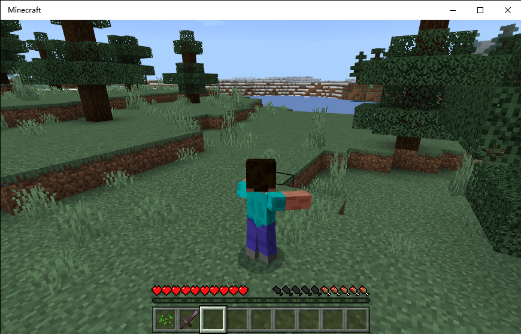
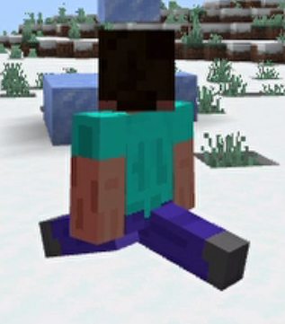

# PlayAnimation

Player can play **Vanilla Animation** in Nukkit with this plugin! 

Sparked by [iGxnon’s SquareLottery](https://github.com/iGxnon/SquareLottery) and [theBigSmileXD's example](https://github.com/thebigsmileXD/xendevtools2), I added some to make this possible **instead of making players quit again and again and tried to fix a mysterious bug**. And today, it released. Hope it can help more people.

**You can also use it in Nukkit, even if this packet is not implemented.**

## Command

/playanimation animationName blendingOutTime

Example:/playanimation animation.armor_stand.hero_pose 4.0

## Vanilla Animation Name
[Minecraft Wiki](https://minecraft.fandom.com/wiki/Commands/playanimation)

[Billbill Article](https://www.bilibili.com/read/cv12704097)

[Minecraft Bedrock Vanilla Resource Pack](https://github.com/ZtechNetwork/MCBVanillaResourcePack)

### animation.armor_stand.entertain_pose


## Make your own vanilla animation
### animation.steve.picha
**Look, steve is doing the splits, and its animation was made by BlockBench!**



### Json Example
``` json
{
	"format_version": "1.8.0",
	"animations": {
		"animation.steve.picha": {
			"animation_length": 4,
			"bones": {
				"RightLeg": {
					"rotation": {
						"0.0": [40, 0, 0],
						"1.0": [82.5, 0, 0],
						"2.0": [82.5, 0, 0],
						"3.0": [45, 0, 0],
						"4.0": [0, 0, 0]
					}
				},
				"LeftLeg": {
					"rotation": {
						"0.0": [-37.5, 0, 0],
						"1.0": [-77.5, 0, 0],
						"2.0": [-77.5, 0, 0],
						"3.0": [-42.5, 0, 0],
						"4.0": [0, 0, 0]
					}
				}
			}
		}
	}
}
```
